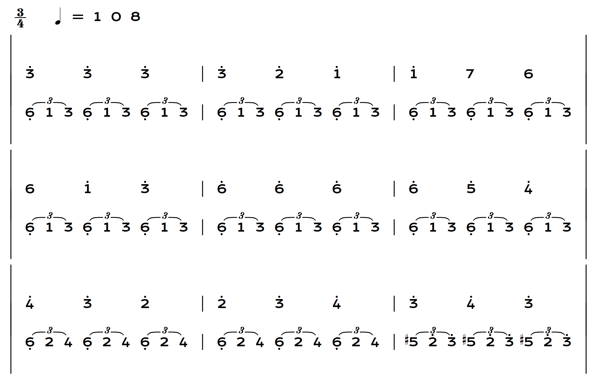
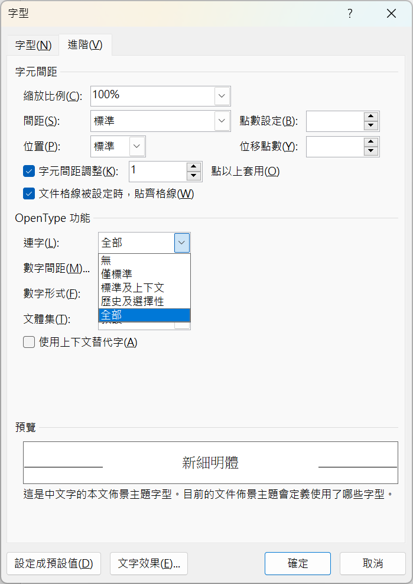

# x-Vacle
An open source Numbered Musical Notation (Jianpu) font. 

用鍵盤字母就能輸入的開源簡譜字型。  

## 簡介

本專案試圖製作一個可完全用一般英文鍵盤就能簡單輸入簡譜的字型，且確保授權沒問題，可開源自由使用。

由於多數字符都來自其它開源字型整合而成，若有改作需求，請注意授權文件。

## 最新版本與下載方式

目前最新版本為 1.000。

請點選本頁面右側「[Releases](https://github.com/ButTaiwan/iansui/releases)」處的最新發行版本，下載 xvacle.zip。解壓縮後安裝裡面的 .ttf 字型檔案即可。

## 說明書

* 鍵盤定義請參考[這份文件](xVacle_KeyValue.pdf)。
* 本字型設計上，目標是能讓 Word 在一般段落設定上只佔單行高度，且所有基本符號不超界。（坊間流傳的其他簡譜字型或有高度極高的問題。）同一頁裡可以容納較多篇幅，但也因此，各種符號設計上會較為擁擠。
* 部分特殊功能（如長的連結線、圓滑線、漸強、漸弱）使用到 OpenType 連字功能。若使用 Word，應開啟連字功能（字型＞進階＞OpenType＞連字，選擇全部）

## 開源授權規定

* 本字型基於 SIL Open Font License 1.1 授權，多數字符又取自其他 OFL 1.1 開源字型專案，包括：
  * [Krona One](https://fonts.google.com/specimen/Krona+One).
  * [Noto Music](https://fonts.google.com/noto/specimen/Noto+Music), The Noto Project Authors, Google Inc.
  * [Yrsa](https://github.com/rosettatype/yrsa-rasa), The Yrsa-Rasa Project Authors.
  * [Bravura](https://github.com/steinbergmedia/bravura), Steinberg Media Technologies GmbH.
* 請注意以上部分字型名稱是保留名稱。
* x-Vacle、XVACLE 是本專案的保留名稱。
* 任何人可以無償使用此字型，包含商用。無須告知原作者。
* 您可自由傳送、分享此字型，或與其他軟體綑綁發行、銷售。捆包中必須同時包含授權文件檔（OFL.txt）。
* 您可自由改造、衍生此字型並公開。修改後的字型必須同樣以 [SIL OFL](https://scripts.sil.org/OFL) 進行發佈，並請勿使用字型的保留名稱。
* 依照 [SIL OFL](https://scripts.sil.org/OFL) 規定，**禁止單獨出售字型檔(ttf/otf)**。
